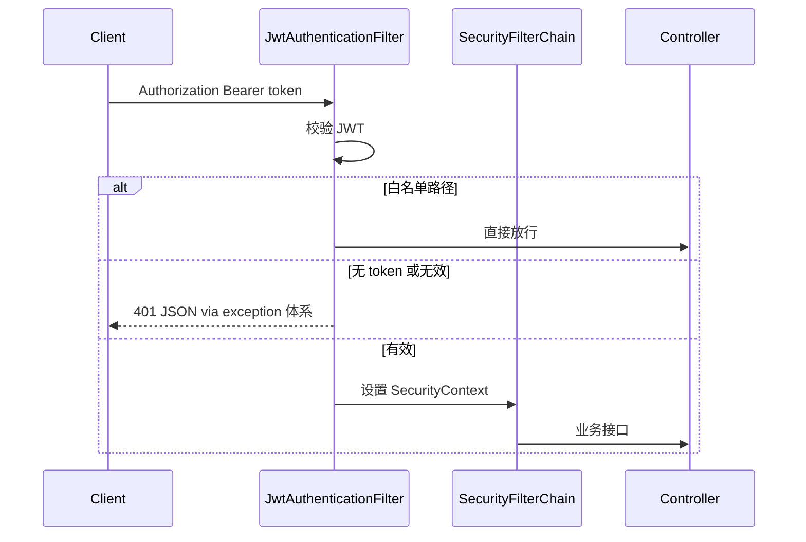

# common-auth · 详细设计

## 1. 架构位置



| 分层 | 职责 |
|------|------|
| API Gateway（若有） | 粗粒度路由、限流、可选第一层 JWT |
| **common-auth（本组件）** | 服务进程内 JWT 校验、白名单、Security 链 |
| **common-exception** | 401/403/500 等统一 JSON 错误体 |

## 2. 包结构（规划）

```
com.company.component.auth/
├── autoconfigure/
│   ├── AuthAutoConfiguration.java
│   └── AuthSecurityAutoConfiguration.java   # Security 链独立配置类
├── properties/AuthProperties.java
├── core/
│   ├── JwtService.java                      # 签发/解析
│   └── JwtClaims.java
├── security/
│   ├── JwtAuthenticationFilter.java
│   └── SecurityPathProperties.java
├── web/（可选）
├── support/OrderConstants.java
└── spi/
    ├── AuthUserDetailsLoader.java
    └── JwtClaimsCustomizer.java
```

## 3. 条件装配（关键）

| 条件 | 说明 |
|------|------|
| `component.auth.enabled=true` | `matchIfMissing=false` |
| `@ConditionalOnWebApplication(SERVLET)` | 非 Servlet 不启用 |
| `@ConditionalOnClass` Security + jjwt | 可选依赖存在 |
| `@ConditionalOnMissingBean` | 业务可覆盖 `SecurityFilterChain`、`JwtService` 等 |

### 3.1 `enabled=false` 时的行为（一期必须满足）

- **不注册**本组件定义的 `SecurityFilterChain`、`JwtAuthenticationFilter`。
- 若 classpath 存在 `spring-boot-starter-security` 且业务未配置：仍可能触发 Spring Boot **默认 Security**（一期文档明确：业务需自行禁用或配置，或暂不引 security starter 到不需要鉴权的服务）。
- 推荐：本组件 `enabled=false` 时，autoconfigure **不**引入额外 Security 自动配置；业务 POM 自行决定是否依赖 `spring-boot-starter-security`。

## 4. 配置属性（AuthProperties）

前缀：`component.auth`

```yaml
component:
  auth:
    enabled: true
    jwt-secret: ${JWT_SECRET}
    expire-minutes: 120
    header-name: Authorization
    token-prefix: "Bearer "
    whitelist:
      - /actuator/health
      - /api/public/**
```

| 字段 | 校验 |
|------|------|
| `jwt-secret` | `enabled=true` 时 `@NotBlank`，最小长度建议 ≥ 32 字符（文档约定） |
| `whitelist` | 默认含 `/error`、`/actuator/health`（实现时合并，可配置覆盖） |

## 5. SecurityFilterChain 设计（一期）

- `SessionCreationPolicy.STATELESS`
- `csrf.disable()`（REST API）
- 白名单：`requestMatchers(whitelist).permitAll()`
- 其余：`authenticated()`
- 在 UsernamePasswordAuthenticationFilter 之前加入 `JwtAuthenticationFilter`
- `@Order`：使用 `OrderConstants.SECURITY_FILTER_CHAIN`

`AuthSecurityAutoConfiguration` 使用：

```java
@AutoConfiguration(after = SecurityAutoConfiguration.class)
```

## 6. JWT

| 项 | 约定 |
|----|------|
| 库 | jjwt（BOM 统一版本） |
| 算法 | HMAC-SHA256（一期） |
| Claims | `sub`（用户名）、`userId`（可选）、`exp` |
| 签发入口 | `JwtService.createToken(...)` 供业务登录接口调用，**不提供**登录 Controller |

## 7. SPI

### AuthUserDetailsLoader

```java
public interface AuthUserDetailsLoader {
    UserDetails loadByUsername(String username);
}
```

- 组件 JWT 过滤器解析出 username 后，可选加载 UserDetails；若一期仅信 JWT claims，可延后强依赖。

### JwtClaimsCustomizer

```java
public interface JwtClaimsCustomizer {
    void customize(JwtBuilder builder, Map<String, Object> context);
}
```

## 8. 与 common-exception 的协作

- 组件**不**自定义 401/403 JSON 结构。
- Security 入口异常、AccessDeniedException 由全局异常体系或 Spring Security 异常转换 + `ComponentGlobalExceptionHandler` 统一（实现期在 sample 验证）。
- 错误码规划：`UNAUTHORIZED`、`FORBIDDEN`（在 exception 映射或 SPI 中扩展）。

## 9. 自动配置注册

`META-INF/spring/org.springframework.boot.autoconfigure.AutoConfiguration.imports`：

```
com.company.component.auth.autoconfigure.AuthAutoConfiguration
com.company.component.auth.autoconfigure.AuthSecurityAutoConfiguration
```

## 10. 测试计划

| # | 场景 |
|---|------|
| 1 | 无 `enabled` → 无组件 Security Bean |
| 2 | `enabled=false` → 无组件 Filter/Chain |
| 3 | `enabled=true` 缺 `jwt-secret` → 启动失败 |
| 4 | 白名单路径匿名访问 200 |
| 5 | 无 Token 访问受保护路径 → 401 |
| 6 | 合法 Token → 200 |
| 7 | 业务自定义 `SecurityFilterChain` → 组件让路 |

## 11. 实施分期

| 阶段 | 内容 | 状态 |
|------|------|------|
| 0 | 本文档 + phase0-checklist | ✅ |
| 1 | Maven 双模块骨架 | ✅ |
| 2 | AuthProperties + 元数据 | ✅ |
| 3 | JwtService + Filter + Security 链 | ✅（白名单 `AntPathRequestMatcher`，避免切片测试依赖 MVC introspector） |
| 4 | 自动配置 + imports | ✅ |
| 5 | 单测 + sample | ✅ |
| 6～7 | 发布 | ✅ SNAPSHOT 可发布（见 [integration.md](./integration.md)） |
| **2.x login** | 登录编排（SMS、注册、测试码） | 阶段 0，见 [login-design.md](./login-design.md) |
