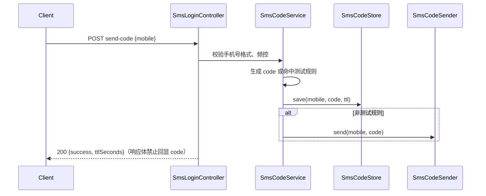
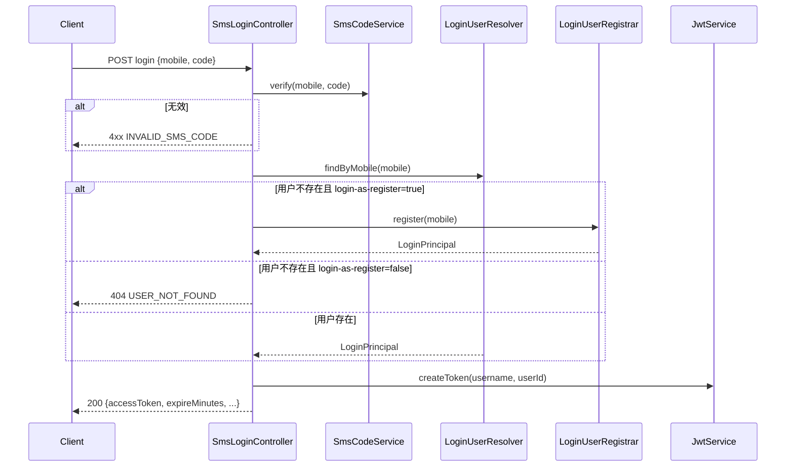

# common-auth · 登录编排子能力设计（阶段 0）

> **状态**：已实现（SMS + 邮箱 + login-redis）；**待办**：第三方短信/邮件 SDK（见根目录 TODO §4.3）  
> **前置**：P1 鉴权（JWT + Security 链）已发布，见 [design.md](./design.md)  
> **配置前缀**：`component.auth.login`（挂在 `component.auth` 域下，不单独 Maven 模块）

---

## 1. 目标与边界

### 1.1 要达成的效果

| 目标 | 说明 |
|------|------|
| 可配置登录方式 | YAML 启用某种 grant 后，自动注册对应 **独立 URL** 的 Controller |
| 短信验证码登录 | 二期首期仅实现 **SMS**；全局 **`sms-length`**（4 或 6 位） |
| 测试环境便利 | **`fixed-code` 与 `mobile-suffix` 二选一**（仅 test 配置，禁止生产误开） |
| 注册能力 | 可选 **独立注册接口**；可选 **登录即注册**（用户不存在时自动开户） |
| 与 P1 协作 | 校验通过后统一调用现有 `JwtService#createToken`，鉴权仍走 `JwtAuthenticationFilter` |

### 1.2 放在组件库 / 放在业务

| 组件库（login 子能力） | 业务系统（SPI） |
|------------------------|-----------------|
| 登录/发码/注册 **HTTP 入口**（路径可配置） | 用户表、手机号归属、风控规则 |
| 请求体验证、grant 开关、流程编排 | 发短信（调用云厂商） |
| 验证码生成长度、TTL、存储抽象（可选 Redis 实现） | `SmsCodeSender`、`LoginUserResolver`、`LoginUserRegistrar` |
| 测试码/尾号规则（**仅 test 配置块**） | 注册时写入的默认昵称、邀请码等 |
| 成功后 JWT 签发、白名单路径自动合并 | 操作日志落库（对接 common-log SPI） |

**禁止**：组件内出现业务 `User` 实体、具体短信模板文案硬编码、生产环境默认测试码。

### 1.3 与独立 `common-sms` 模块的关系

- 路线图中有 `component.sms`（待建设）。**本期** login 通过 `SmsCodeSender` SPI 发码，业务可先直连厂商 SDK。
- 将来 `common-sms` 可提供 `SmsCodeSender` 默认实现，login 模块通过 `@ConditionalOnBean` 优先使用。

---

## 2. 总开关与条件装配

| 条件 | 行为 |
|------|------|
| `component.auth.enabled=false` | 整个 auth 不启用；login **不注册** |
| `component.auth.login.enabled=false`（默认） | 不注册 login 相关 Bean/Controller（**matchIfMissing=false**） |
| `component.auth.login.enabled=true` | 要求 `component.auth.enabled=true`，否则 **启动失败** |
| 某 grant `*.enabled=true` | 注册该 grant 的 Controller；校验该 grant **必需 SPI** 是否存在 |

包结构（规划，仍在 `common-auth-autoconfigure` 内）：

```
com.company.component.auth.login/
├── autoconfigure/LoginAutoConfiguration.java
├── properties/LoginProperties.java
├── core/
│   ├── SmsCodeService.java          # 生成/校验/测试规则
│   └── LoginTokenIssuer.java        # 封装 JwtService + context
├── web/
│   ├── SmsLoginController.java
│   └── SmsRegisterController.java   # register.enabled 时
├── support/LoginPathWhitelistContributor.java
└── spi/
    ├── SmsCodeSender.java
    ├── SmsCodeStore.java            # 可选，无 Bean 时用内存（仅 dev/test 文档警告）
    ├── LoginUserResolver.java
    └── LoginUserRegistrar.java      # login-as-register / 显式注册
```

`META-INF/spring/...AutoConfiguration.imports` 增加一行 `LoginAutoConfiguration`（`after` AuthAutoConfiguration）。

---

## 3. 入口形态：每种方式独立 URL

首期仅 SMS，拆为 **发码** 与 **登录** 两个接口（路径均可配置）：

| 能力 | 默认路径（可覆盖） | 方法 |
|------|-------------------|------|
| 发送短信验证码 | `/api/auth/sms/send-code` | `POST` |
| 短信验证码登录 | `/api/auth/sms/login` | `POST` |
| 短信注册（可选） | `/api/auth/sms/register` | `POST` |
| 发送邮箱验证码 | `/api/auth/email/send-code` | `POST` |
| 邮箱验证码登录 | `/api/auth/email/login` | `POST` |
| 邮箱注册（可选） | `/api/auth/email/register` | `POST` |

配置示例：

```yaml
component:
  auth:
    enabled: true
    jwt-secret: ${JWT_SECRET}
    login:
      enabled: true
      sms-length: 6                    # 全局验证码位数，仅允许 4 或 6
      sms:
        enabled: true
        code-ttl-seconds: 300
        resend-interval-seconds: 60
        paths:
          send-code: /api/auth/sms/send-code
          login: /api/auth/sms/login
      register:
        enabled: true
        login-as-register: true
        paths:
          register: /api/auth/sms/register
```

**白名单**：`LoginAutoConfiguration` 将 `paths.*` 自动合并进 Security 白名单（或通过 `AuthPathMatcher` 统一贡献），避免业务漏配导致发码接口 401。

后续若增加 `password` grant，各自独立路径，例如 `/api/auth/password/login`，**不**使用统一 `grantType` 单入口。

---

## 4. 短信验证码

### 4.1 可配置项

| 配置键 | 类型 | 默认 | 校验 |
|--------|------|------|------|
| `login.sms-length` | int | `6` | **仅允许 `4` 或 `6`**（发码、验码、请求体校验统一） |
| `login.sms.enabled` | boolean | `false` | 与 `login.enabled` 联动 |
| `login.sms.code-ttl-seconds` | int | `300` | > 0 |
| `login.sms.resend-interval-seconds` | int | `60` | ≥ 30，防刷 |
| `login.sms.paths.send-code` | string | 见上 | 非空，以 `/` 开头 |
| `login.sms.paths.login` | string | 见上 | 非空 |

验证码字符集：数字 `0-9`（一期）；位数由 **`login.sms-length`** 决定（正式环境随机生成；测试环境见 §5）。

请求体验证：`code` 字段长度必须等于 `sms-length`，否则 `INVALID_SMS_CODE`。

### 4.2 发码流程



### 4.3 登录流程



---

## 5. 测试环境：固定码 / 手机尾号（二选一）

**原则**（建设指南 §5.6）：组件 **不** 读取 `spring.profiles.active`；测试行为仅通过 **`component.auth.login.test.*`** 开启，配置写在 `application-test.yml` 等。

测试模式下 **只允许一种验码方式**，与正式环境的 `SmsCodeStore` 校验互斥：

| 模式 | 配置 | 验码规则 |
|------|------|----------|
| **固定验证码** | `fixed-code: "123456"`（且 `mobile-suffix` 不为 `true`） | 任意手机号，提交的 `code` 等于 `fixed-code` 即通过 |
| **手机尾号** | `mobile-suffix: true`（且不配置 `fixed-code`） | 提交的 `code` 必须等于该手机号 **后 `sms-length` 位**（与正式发码位数一致） |

示例 A — 固定码（`sms-length: 6`）：

```yaml
component:
  auth:
    login:
      sms-length: 6
      test:
        allow-in-production: true
        sms:
          enabled: true
          fixed-code: "123456"
        email:
          enabled: true
          fixed-code: "123456"
```

邮箱测试模式**仅支持** `test.email.fixed-code`（无尾号模式）。

示例 B — 手机尾号（`sms-length: 4`）：

```yaml
component:
  auth:
    login:
      sms-length: 4
      test:
        enabled: true
        mobile-suffix: true
```

手机号 `13800138888`、尾号模式、`sms-length: 4` → 有效验证码为 **`8888`**（末 4 位）。

### 5.1 配置项

| 配置键 | 类型 | 默认 | 说明 |
|--------|------|------|------|
| `login.test.enabled` | boolean | `false` | `true` 时进入测试验码逻辑 |
| `login.test.fixed-code` | string | 无 | 固定码模式；**长度必须等于 `sms-length`** |
| `login.test.mobile-suffix` | boolean | `false` | `true` 为尾号模式 |

**不提供的配置**（已废弃草案）：`mobile-suffix-rules` 列表、按后缀单独配置不同验证码。

### 5.2 启动校验（`test.enabled=true` 时）

1. **`fixed-code` 与 `mobile-suffix=true` 不能同时生效**（同时配置 → 启动失败）。  
2. **必须二选一**：配置了非空 `fixed-code`，或 `mobile-suffix=true`；否则启动失败。  
3. `fixed-code` 字符长度 **必须等于** `login.sms-length`。  
4. `mobile-suffix=true` 时 **禁止** 配置 `fixed-code`（含空字符串占位，实现按「有值」判断）。

### 5.3 运行时行为

- `test.enabled=false`：仅 `SmsCodeStore` 正常校验；发码调用 `SmsCodeSender`。  
- `test.enabled=true`：按上表二选一验码；**可不调用** `SmsCodeSender`（发码接口仍返回 200，日志 DEBUG 标明 test mode）。  
- 测试模式 **不写入** Store（避免与正式 Redis 混用）；登录/注册共用同一套 `SmsCodeService#verify`。

**生产防呆（`test.allow-in-production`）**：

| 项 | 说明 |
|----|------|
| 作用 | 当 `test.sms` 或 `test.email` 任一测试验码开启时，**必须**设为 `true`，否则 **启动失败** |
| 含义 | 声明「当前环境已知情并有意启用测试验码」，**不是**允许在生产使用固定码 |
| 本地/CI | 写在 `application-test.yml` 等，可设为 `true` |
| 正式生产 | **禁止**开启 `test.sms` / `test.email`；`allow-in-production` 保持默认 `false` |

---

## 6. 注册：是否在本模块？登录即注册？

**结论：是，注册 HTTP 能力归属 `component.auth.login` 子能力，与登录同样可配置开关。**

| 模式 | 配置 | 行为 |
|------|------|------|
| 仅登录 | `register.enabled=false` | 用户不存在 → `USER_NOT_FOUND`（或 401，与 exception 映射统一） |
| 独立注册 | `register.enabled=true`，`login-as-register=false` | 暴露 `POST register.paths.register`；须先注册再登录 |
| 登录即注册 | `register.enabled=true`，`login-as-register=true` | 登录接口验码通过后，无用户则调 `LoginUserRegistrar` 再签发 JWT |
| 两者并存 | 同上 + 独立注册路径 | 显式注册走 register；登录可走 login-as-register（适合活动拉新） |

独立注册请求体（一期 SMS）：

```json
POST /api/auth/sms/register
{
  "mobile": "13800138000",
  "code": "123456",
  "inviteCode": "optional-business-field"
}
```

- 组件只校验 `mobile` + `code`；`inviteCode` 等扩展字段通过 SPI `LoginUserRegistrar#register(RegisterContext)` 传入，**不**在组件 Properties 硬编码业务字段列表（Context 用 `Map<String, Object>` 或专用 DTO 由 SPI 文档约定）。

**SPI 契约（草案）**：

```java
public interface LoginUserResolver {
    Optional<LoginPrincipal> findByMobile(String mobile);
}

public interface LoginUserRegistrar {
    LoginPrincipal register(RegisterRequest request);
}

public record LoginPrincipal(String username, Long userId, Map<String, Object> attributes) {}
```

---

## 7. SPI 一览

| SPI | 必需条件 | 职责 |
|-----|----------|------|
| `SmsCodeSender` | `login.sms.enabled=true` 且非测试发码 | 调用短信通道 |
| `SmsCodeStore` | 可选；无实现时内存 Store（**仅** sample/dev，启动 WARN） | 存码、校验、删除已用码 |
| `LoginUserResolver` | `login.enabled=true` | 按手机号查用户 |
| `LoginUserRegistrar` | `register.enabled=true` 或 `login-as-register=true` | 创建用户 |
| `JwtClaimsCustomizer` | 可选（已有） | 签发前写租户/角色等 |

**启动失败场景**：

- `login.sms.enabled=true` 且无 `SmsCodeSender` 且 `login.test.enabled=false`  
- `login-as-register=true` 且无 `LoginUserRegistrar`  
- `register.enabled=true` 且无 `LoginUserRegistrar`

---

## 8. HTTP 契约（一期 SMS）

### 8.1 发码

```http
POST /api/auth/sms/send-code
Content-Type: application/json

{"mobile": "13800138000"}
```

响应（示例）：

```json
{
  "success": true,
  "ttlSeconds": 300,
  "resendAfterSeconds": 60
}
```

错误码（纳入 exception 映射规划）：`INVALID_MOBILE`、`SMS_SEND_TOO_FREQUENT`、`SMS_SEND_FAILED`。

### 8.2 登录

```http
POST /api/auth/sms/login
Content-Type: application/json

{"mobile": "13800138000", "code": "123456"}
```

响应（示例）：

```json
{
  "accessToken": "eyJ...",
  "tokenType": "Bearer",
  "expireMinutes": 120,
  "userId": 10001,
  "username": "13800138000"
}
```

### 8.3 注册（可选）

与登录相同字段；成功返回可与登录相同（直接返回 token）或仅返回 `userId`（配置项 `register.issue-token-on-register`，默认 `true`）。

---

## 9. 与 common-log / common-exception

| 协作 | 约定 |
|------|------|
| exception | 新增映射：`INVALID_SMS_CODE`、`USER_NOT_FOUND`、`MOBILE_ALREADY_REGISTERED` 等 |
| log | 登录/注册成功或失败可走 `@OperationLog`（业务切面）或 SPI `LoginAuditRecorder`（二期可选） |
| 日志脱敏 | 禁止打印完整验证码；test 模式仅 DEBUG 标记 |

---

## 10. 实施分期

| 阶段 | 内容 | 状态 |
|------|------|------|
| 0 | 本文档 + [login-phase0-checklist.md](./login-phase0-checklist.md) | ✅ |
| 1 | `LoginProperties` + 元数据 + 条件装配骨架 | ✅ |
| 2 | `SmsCodeService` + 测试规则 + `SmsLoginController`（发码/登录） | ✅ |
| 3 | 注册 Controller + `login-as-register` + SPI 校验 | ✅ |
| 4 | 单测 + sample SPI + 冒烟用例 | ✅ |
| 5 | [integration.md](./integration.md) 增补 login 章节 | ✅ |
| 6 | `common-auth-login-redis-*`（Redis Store） | ✅ |

**版本**：登录编排随 `common-auth` **MINOR** 升级（如 `1.1.0-SNAPSHOT`），破坏性变更走 MAJOR。

---

## 11. 测试计划

| # | 场景 |
|---|------|
| 1 | `login.enabled=false` → 无 login Controller |
| 2 | `login.enabled=true` 且 `auth.enabled=false` → 启动失败 |
| 3 | `sms.enabled=true` 缺 `SmsCodeSender` 且 `test.enabled=false` → 启动失败 |
| 4 | 发码 → 登录成功返回 JWT |
| 5 | 错误码 → 401/400 + 统一 JSON |
| 6 | `test.fixed-code` + 任意手机号登录成功，且不调用 Sender |
| 7 | `test.mobile-suffix=true`，`code`=手机号末 `sms-length` 位通过 |
| 7b | 同时配置 `fixed-code` 与 `mobile-suffix=true` → 启动失败 |
| 8 | `login-as-register=true` 新手机号自动注册并返回 token |
| 9 | `register.enabled=true` 独立注册路径；已注册手机号 → `MOBILE_ALREADY_REGISTERED` |
| 10 | login 路径在白名单，无 JWT 可访问 |

---

## 12. 团队已确认决策（2026-06-04）

| # | 决策 |
|---|------|
| 1 | **每种登录方式独立 URL**（非统一 `grantType` 入口） |
| 2 | 首期仅 **短信验证码**；全局 **`sms-length` 仅 4 或 6** |
| 3 | 测试环境 **`fixed-code` / `mobile-suffix` 二选一**；生产防呆启动校验 |
| 6 | （2026-06-04 修订）取消 `mobile-suffix-rules` 列表配置 |
| 4 | **注册接口** 归属 login 子能力，可配置开关 |
| 5 | 支持 **登录即注册**（`login-as-register`） |

**下一步**：对接生产 `SmsCodeSender` / `EmailCodeSender`（第三方 SDK）；Redis Store 见 `common-auth-login-redis-spring-boot-starter`。
