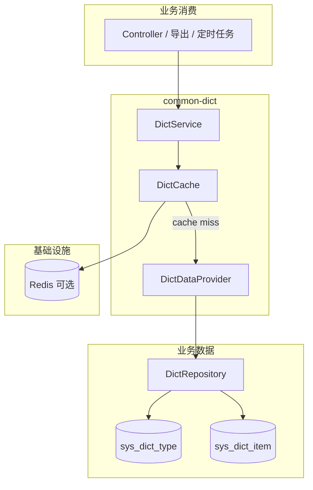

# common-dict · 详细设计（阶段 0）

> **状态**：一期已实现（`DictService` + 缓存）；HTTP API 二期  
> **配置前缀**：`component.dict`  
> **Maven**：`common-dict-autoconfigure` + `common-dict-spring-boot-starter`

---

## 1. 目标与边界

### 1.1 要达成的效果

| 目标 | 说明 |
|------|------|
| 统一读模型 | 业务通过 `DictService` 获取字典项，不各自实现缓存 |
| 统一表规范 | 团队共用 **`sys_dict_type` / `sys_dict_item`** 物理表 |
| 可插拔缓存 | 默认内存；生产 / docker 用 Redis，配置切换 |
| 数据源反转 | 加载逻辑走 **`DictDataProvider` SPI**，组件无 SQL |
| 可失效 | 管理端改库后 `refresh`，多实例通过 Redis 一致 |

### 1.2 组件库 / 业务分工

| 组件库 | 业务系统 |
|--------|----------|
| `DictService`、`DictItem` 模型 | 表 DDL、迁移脚本、管理后台 CRUD |
| `DictCache`（memory / redis） | `DictDataProvider` 实现（MyBatis/JPA） |
| `DictProperties`、条件装配 | 改字典后的 `refresh` 触发（管理 API / 定时） |
| 错误码映射规划（exception） | 租户隔离、审计、权限 |

**禁止**：组件内硬编码某业务字典内容；组件内依赖业务 module。

---

## 2. 架构位置



### 2.1 读路径

```text
dictService.getItems(dictType)
  → DictCache.get(dictType)
  → hit: 返回 List<DictItem>
  → miss: DictDataProvider.loadByType(dictType)
  → 写缓存（含空列表防穿透策略）→ 返回

dictService.getLabel(dictType, code)
  → getItems(dictType) 后按 code 匹配 label
  → 未找到：返回 Optional.empty() 或抛 DictException（实现时二选一，见 §7）
```

### 2.2 写路径（缓存失效）

组件**不提供**字典写入 API。业务管理端更新 DB 后：

```text
dictService.refresh(dictType)   // 删除该 type 缓存，下次读穿透
dictService.refreshAll()        // 删除本应用 dict key 命名空间下全部缓存
```

---

## 3. 包结构（规划）

```
com.company.component.dict/
├── autoconfigure/DictAutoConfiguration.java
├── properties/DictProperties.java
├── core/
│   ├── DictItem.java
│   ├── DictService.java
│   └── DictException.java              # 领域异常 → exception 映射
├── cache/
│   ├── DictCache.java                  # 接口
│   ├── InMemoryDictCache.java
│   └── RedisDictCache.java             # @ConditionalOnClass + type=redis
└── spi/
    └── DictDataProvider.java
```

**一期不创建** `web/DictController.java`（二期）。

`META-INF/spring/org.springframework.boot.autoconfigure.AutoConfiguration.imports`：

```
com.company.component.dict.autoconfigure.DictAutoConfiguration
```

---

## 4. 统一字典表规范

全团队业务库采用以下两张表。组件**不**内置 Flyway/Liquibase；sample 可提供参考 DDL 与内存/H2 演示数据。

### 4.0 命名规范（数据库 vs Java vs 配置）

**强制分层，禁止混用**：

| 层级 | 风格 | 示例 | 说明 |
|------|------|------|------|
| **数据库列名** | `snake_case`（小写 + 下划线） | `dict_type`、`item_code`、`is_builtin` | DDL、SQL、MyBatis `resultMap` / JPA `@Column(name=...)` **只写 snake_case** |
| **Java 字段 / API 参数** | `camelCase` | `dictType`、`code`、`itemValue` | 组件 `DictItem`、Service 方法形参、未来 JSON 响应体 |
| **Spring 配置键** | `kebab-case` | `cache.key-prefix`、`null-ttl-seconds` | 前缀 `component.dict.*`，遵循 Boot 惯例 |
| **Redis 缓存 key** | 小写 + 冒号分段 | `{prefix}:order_status` | 段内为**字典类型取值**（如 `order_status`），不用 camelCase |

**原则**：

1. 物理表、原生 SQL：**一律 `dict_type`，禁止 `dictType`**。
2. 组件库 Java 模型：**一律 `dictType`，禁止 `dict_type` 作字段名**（JSON 序列化同为 camelCase，二期 HTTP API 一致）。
3. 业务持久化层负责 **snake_case ↔ camelCase 映射**；组件 `DictDataProvider` 返回已映射好的 `DictItem`。

**完整映射表**：

| 数据库列（snake_case） | Java / JSON（camelCase） | 出现于 |
|------------------------|--------------------------|--------|
| `dict_type` | `dictType` | 类型编码；`loadByType(dictType)` 参数即此值的字符串 |
| `dict_name` | `dictName` | 业务 Entity / 管理端；**一期 `DictItem` 不含** |
| `dict_source` | `dictSource` | 业务 Entity；一期组件不读 |
| `is_builtin` | `isBuiltin` | 业务 Entity（`boolean`）；一期组件不读 |
| `item_code` | `code` | `DictItem.code`（领域模型用短名，见下） |
| `item_label` | `label` | `DictItem.label` |
| `item_value` | `value` | `DictItem.value` |
| `sort_order` | `sortOrder` | `DictItem.sortOrder` |
| `css_class` | `cssClass` | `DictItem.cssClass` |
| `extra_json` | `extra` | `DictItem.extra`（`Map`，非原始 JSON 字符串） |
| `enabled` | `enabled` | 业务 Entity |
| `created_at` / `updated_at` | `createdAt` / `updatedAt` | 业务 Entity |

**为何 `DictItem` 用 `code` / `label` / `value` 而非 `itemCode`？**

- 在「字典项」上下文中，`code`/`label`/`value` 语义已足够清晰，API 更短。
- 与表列 `item_*` 的对应关系在 SPI 映射层一次性完成，调用方无需带 `item` 前缀。

**业务 Entity 示例（JPA）**：

```java
@Column(name = "dict_type", nullable = false, length = 64)
private String dictType;

@Column(name = "item_code", nullable = false, length = 256)
private String itemCode;
```

**业务 MyBatis**：`result` 中 `column="dict_type" property="dictType"`，`column="item_code" property="itemCode"`。

**禁止**：

- 表结构或 SQL 使用 camelCase 列名（如 `` `dictType` ``）。
- 在 `DictItem`、`DictService` 公共 API 上使用 snake_case（如 `get_label`）。
- 同一概念在单层出现两种风格（如 Java 里同时存在 `dict_type` 与 `dictType` 两个字段）。

### 4.1 `sys_dict_type`（字典类型）

| 列名 | 类型 | 约束 | 说明 |
|------|------|------|------|
| `id` | BIGINT | PK, 自增 | 主键 |
| `dict_type` | VARCHAR(64) | UNIQUE, NOT NULL | 类型编码，如 `order_status` |
| `dict_name` | VARCHAR(128) | NOT NULL | 类型名称，如「订单状态」 |
| `dict_source` | VARCHAR(32) | NOT NULL, DEFAULT `'DB'` | 字典来源，见 §4.3 |
| `is_builtin` | TINYINT(1) | NOT NULL, DEFAULT 0 | 是否系统内置：1=内置，**禁止删类型 / 改 `dict_type` 编码** |
| `remark` | VARCHAR(512) | NULL | 备注 |
| `enabled` | TINYINT(1) | NOT NULL, DEFAULT 1 | 0=停用整个类型 |
| `created_at` | DATETIME | NOT NULL | 创建时间 |
| `updated_at` | DATETIME | NOT NULL | 更新时间 |

### 4.2 `sys_dict_item`（字典项）

| 列名 | 类型 | 约束 | 说明 |
|------|------|------|------|
| `id` | BIGINT | PK, 自增 | 主键 |
| `dict_type` | VARCHAR(64) | NOT NULL, INDEX | 关联类型编码 |
| `item_code` | VARCHAR(256) | NOT NULL | 项编码，如 `1`、`FULL_PAID`、`USER_APPLY_CANCEL` |
| `item_label` | VARCHAR(256) | NOT NULL | 展示文案，如「待支付」「男」 |
| `item_value` | VARCHAR(512) | NULL | 项真实值（与 code 可不同），如 code=`1` label=`男` value=`M` |
| `sort_order` | INT | NOT NULL, DEFAULT 0 | 升序排列 |
| `enabled` | TINYINT(1) | NOT NULL, DEFAULT 1 | 0=停用该项 |
| `css_class` | VARCHAR(64) | NULL | 前端样式（可选） |
| `extra_json` | TEXT | NULL | 扩展属性 JSON（业务自定义，可能较大） |
| `remark` | VARCHAR(512) | NULL | 备注 |
| `created_at` | DATETIME | NOT NULL | |
| `updated_at` | DATETIME | NOT NULL | |

**唯一约束**：`UNIQUE (dict_type, item_code)`。

**`item_code` / `item_value` 语义**：

| 字段 | 典型用途 |
|------|----------|
| `item_code` | 对外稳定编码、下拉 value、落库外键引用 |
| `item_value` | 对接第三方/协议用的真实值；无差异时可 NULL（使用时等同 `item_code`） |
| `item_label` | 界面展示、导出中文名 |

### 4.3 `dict_source` 枚举（类型表）

为后续 SPI 多数据源扩展预留；一期默认均为 `DB`。

| 值 | 含义 | 一期 |
|----|------|------|
| `DB` | 来自 `sys_dict_item` 数据库 | ✅ 默认，`DictDataProvider` 实现 |
| `CONFIG` | 来自配置中心（Nacos 等） | 二期：独立 Provider 或路由 SPI |
| `REMOTE` | 来自远程 HTTP/RPC 服务 | 二期：独立 Provider 或路由 SPI |

一期组件**不读取** `dict_source` 做路由；字段由业务写入，供管理端展示与未来 `CompositeDictDataProvider` 按 type 分发。

### 4.4 `is_builtin` 治理约定（业务管理端）

组件库**不**实现字典 CRUD；以下规则由**业务管理后台**强制执行：

| `is_builtin` | 规则 |
|--------------|------|
| `1` | 禁止删除该 `dict_type`；禁止修改 `dict_type` 编码；允许改 `dict_name`、项 label/value（按产品约定） |
| `0` | 常规定义，可增删改 |

内置字典示例：`gender`、`yes_no`、`enable_status` 等系统级码表。

### 4.5 参考 DDL（MySQL 8）

```sql
CREATE TABLE sys_dict_type (
    id          BIGINT       NOT NULL AUTO_INCREMENT PRIMARY KEY,
    dict_type   VARCHAR(64)  NOT NULL,
    dict_name   VARCHAR(128) NOT NULL,
    dict_source VARCHAR(32)  NOT NULL DEFAULT 'DB',
    is_builtin  TINYINT(1)   NOT NULL DEFAULT 0,
    remark      VARCHAR(512) NULL,
    enabled     TINYINT(1)   NOT NULL DEFAULT 1,
    created_at  DATETIME     NOT NULL DEFAULT CURRENT_TIMESTAMP,
    updated_at  DATETIME     NOT NULL DEFAULT CURRENT_TIMESTAMP ON UPDATE CURRENT_TIMESTAMP,
    UNIQUE KEY uk_dict_type (dict_type)
) ENGINE=InnoDB DEFAULT CHARSET=utf8mb4;

CREATE TABLE sys_dict_item (
    id          BIGINT       NOT NULL AUTO_INCREMENT PRIMARY KEY,
    dict_type   VARCHAR(64)  NOT NULL,
    item_code   VARCHAR(256) NOT NULL,
    item_label  VARCHAR(256) NOT NULL,
    item_value  VARCHAR(512) NULL,
    sort_order  INT          NOT NULL DEFAULT 0,
    enabled     TINYINT(1)   NOT NULL DEFAULT 1,
    css_class   VARCHAR(64)  NULL,
    extra_json  TEXT         NULL,
    remark      VARCHAR(512) NULL,
    created_at  DATETIME     NOT NULL DEFAULT CURRENT_TIMESTAMP,
    updated_at  DATETIME     NOT NULL DEFAULT CURRENT_TIMESTAMP ON UPDATE CURRENT_TIMESTAMP,
    UNIQUE KEY uk_dict_type_code (dict_type, item_code),
    KEY idx_dict_type (dict_type)
) ENGINE=InnoDB DEFAULT CHARSET=utf8mb4;
```

### 4.6 `DictDataProvider` 加载约定

实现方职责（`dict_source=DB` 场景）：

1. 校验 `sys_dict_type.enabled=1`，否则视为类型不存在或返回空（与 §7 错误策略一致）。
2. 仅加载 `sys_dict_item.enabled=1` 的记录。
3. 按 `sort_order ASC`, `id ASC` 排序。
4. 映射为 `DictItem`（见 §5）；`item_value` 为 NULL 时 `DictItem.value()` 回退为 `item_code`。
5. **不**在 SPI 内做缓存（缓存仅 `DictCache`）。
6. **不**在一期 Provider 内解释 `dict_source` / `is_builtin`（类型元数据留给业务管理端；二期可增加 `DictTypeResolver` SPI）。

---

## 5. 领域模型

### 5.1 `DictItem`（组件库模型）

命名遵循 [§4.0](#40-命名规范数据库-vs-java-vs-配置)：表列 `snake_case`，模型字段 `camelCase`。

| 字段 | 类型 | 来源 |
|------|------|------|
| `dictType` | String | `sys_dict_type.dict_type` |
| `code` | String | `sys_dict_item.item_code`（最长 256） |
| `label` | String | `sys_dict_item.item_label` |
| `value` | String | `sys_dict_item.item_value`；NULL 时等于 `code` |
| `sortOrder` | int | `sys_dict_item.sort_order` |
| `cssClass` | String | 可选 |
| `extra` | `Map<String, Object>` | 解析 `extra_json`（TEXT），解析失败抛异常 |

列表不可变；`DictService` 返回防御性拷贝或不可变集合。

示例（性别字典）：

| code | label | value |
|------|-------|-------|
| `1` | 男 | `M` |
| `2` | 女 | `F` |

### 5.2 `DictDataProvider` SPI

```java
public interface DictDataProvider {

    /**
     * 加载指定类型的有效字典项（已过滤 disabled、已排序）。
     * @throws RuntimeException 数据源不可用时抛出，禁止吞异常
     */
    List<DictItem> loadByType(String dictType);
}
```

| 条件 | 行为 |
|------|------|
| `component.dict.enabled=true` | **必须**存在 `DictDataProvider` Bean，否则启动失败 |
| `enabled=false` | 不注册 `DictService` / `DictCache` |

---

## 6. `DictService` API（一期唯一对外能力）

```java
public interface DictService {

    List<DictItem> getItems(String dictType);

    Optional<String> getLabel(String dictType, String code);

    Optional<String> getValue(String dictType, String code);

    String requireLabel(String dictType, String code);  // 无 label 时抛 DictException

    String requireValue(String dictType, String code);  // 无项时抛 DictException

    void refresh(String dictType);

    void refreshAll();
}
```

| 方法 | 说明 |
|------|------|
| `getItems` | 走缓存；type 不存在时策略见 §7 |
| `getLabel` | 基于 `getItems`；code 无匹配返回 `Optional.empty()` |
| `getValue` | 返回 `DictItem.value()`（已含 NULL→code 回退） |
| `requireLabel` | 报表/导出等不容缺失的场景 |
| `requireValue` | 对接外部系统、协议字段等不容缺失的场景 |
| `refresh` | 删指定 type 缓存 |
| `refreshAll` | 删本组件 key 前缀下全部 dict 缓存 |

---

## 7. 配置

### 7.1 `component.dict`

```yaml
component:
  dict:
    enabled: true
    cache:
      type: memory              # memory | redis
      ttl-seconds: 3600
      key-prefix: "${spring.application.name:app}:dict"
      null-ttl-seconds: 60      # 空列表短 TTL，防缓存穿透
```

| 配置键 | 类型 | 默认 | 校验 |
|--------|------|------|------|
| `enabled` | boolean | `false` | `matchIfMissing=false` |
| `cache.type` | string | `memory` | 仅 `memory` \| `redis` |
| `cache.ttl-seconds` | int | `3600` | > 0 |
| `cache.key-prefix` | string | 见上 | 非空，禁止写死环境相关值 |
| `cache.null-ttl-seconds` | int | `60` | ≥ 0；0 表示不缓存空结果 |

### 7.2 Redis 连接（基础设施）

```yaml
spring:
  data:
    redis:
      host: localhost
      port: 6379
```

`cache.type=redis` 时：

- 要求 classpath 存在 `StringRedisTemplate`（`spring-boot-starter-data-redis`）。
- 无 `StringRedisTemplate` → **启动失败**（显式错误，不静默回退 memory）。

### 7.3 sample / docker 约定（团队决策）

| Profile | `cache.type` | 说明 |
|---------|--------------|------|
| 默认（`application.yml`） | `memory` | 本地 `run-sample` 无 Redis 依赖 |
| `docker`（`application-docker.yml`） | `redis` | 连接 compose `redis` 服务 |

```yaml
# application.yml（sample 规划片段）
component:
  dict:
    enabled: true
    cache:
      type: memory

# application-docker.yml（sample 规划片段）
component:
  dict:
    cache:
      type: redis
spring:
  data:
    redis:
      host: redis
```

---

## 8. 缓存实现

### 8.1 内存 `InMemoryDictCache`

- `ConcurrentHashMap<String, CacheEntry>`，`CacheEntry` 含 `List<DictItem>` + 过期时间。
- 仅单 JVM 有效；**sample 默认**。
- 启动时 DEBUG 日志标明 `memory` 模式。

### 8.2 Redis `RedisDictCache`

**Key 规范**（`key-prefix` 默认 `sample-boot-app:dict`）：

| Key | 值 | TTL |
|-----|-----|-----|
| `{prefix}:{dictType}` | JSON 数组 `List<DictItem>` | `ttl-seconds` |
| `{prefix}:__empty__:{dictType}` | 占位 `1` | `null-ttl-seconds`（空结果防穿透） |

**`refresh(dictType)`**：`DEL {prefix}:{dictType}` 与 `{prefix}:__empty__:{dictType}`。

**`refreshAll()`**：`SCAN` + `DEL` 匹配 `{prefix}:*`（实现时注意 Redis 集群与生产安全，一期 sample 用 `keys` 仅测试）。

序列化：JSON（Jackson），与组件其他模块一致；**禁止** Java 原生序列化。

### 8.3 与 login 验证码 Store 的 key 隔离

| 模块 | 前缀示例 |
|------|----------|
| dict | `sample-boot-app:dict:order_status` |
| login（未来） | `sample-boot-app:login:sms:code:138...` |

同一 Redis 实例，前缀不可混用。

---

## 9. 条件装配

| 条件 | 行为 |
|------|------|
| `component.dict.enabled=false` | 不注册 dict Bean |
| `enabled=true` 且无 `DictDataProvider` | **启动失败** |
| `cache.type=memory` | 注册 `InMemoryDictCache` |
| `cache.type=redis` | 注册 `RedisDictCache`；缺 `StringRedisTemplate` → 启动失败 |
| `@ConditionalOnMissingBean(DictCache.class)` | 业务可完全自定义缓存 |

依赖：

- `common-dict-autoconfigure`：`spring-boot-autoconfigure`、可选 `spring-boot-starter-data-redis`（`optional` + `@ConditionalOnClass`）。
- **不** compile 依赖 `common-exception`；异常类在 dict 模块定义，映射在 exception 侧或 `DictException` + `MappedHttpStatusException` 模式（与 login 一致，实现时对齐 auth）。

---

## 10. 与 common-exception / common-auth

| 协作 | 约定 |
|------|------|
| exception | 规划错误码：`DICT_TYPE_NOT_FOUND`、`DICT_LOAD_FAILED`；HTTP 4xx/5xx + 统一 JSON |
| auth | 一期无 HTTP API，**无白名单需求**；二期 Controller 再合并白名单 |
| log | 可选 DEBUG：`dict cache hit/miss type=...`；**禁止**打印全量字典敏感内容 |

---

## 11. 实施分期

| 阶段 | 内容 | 状态 |
|------|------|------|
| 0 | 本文档 + [phase0-checklist.md](./phase0-checklist.md) | ✅ |
| 1 | POM 骨架 + `DictProperties` + 条件装配 | ✅ |
| 2 | `DictDataProvider` SPI + `InMemoryDictCache` + `DictService` | ✅ |
| 3 | `RedisDictCache` + `cache.type=redis` 分支 | ✅ |
| 4 | 单测 + sample（`SampleDictSpiConfiguration`） | ✅ |
| 5 | `integration.md` + BOM 登记 + CHANGELOG | 🟡 CHANGELOG 已记；integration 待补 |
| **二期** | `DictController` + 白名单 + 冒烟用例 | ⬜ |

**版本**：首个可发布建议 **`1.0.0-SNAPSHOT`**（新模块）；或随 BOM `${revision}` 统一版本，实现前在 BOM 登记。

---

## 12. 测试计划

| # | 场景 |
|---|------|
| 1 | `dict.enabled=false` → 无 `DictService` Bean |
| 2 | `enabled=true` 缺 `DictDataProvider` → 启动失败 |
| 3 | `cache.type=memory`：首次 miss 加载 SPI，二次 hit 不调 SPI |
| 4 | `refresh(dictType)` 后再次 miss |
| 5 | `getLabel` / `getValue` 存在 / 不存在；`item_value` NULL 时 value 回退 code |
| 6 | `cache.type=redis` + Testcontainers：多实例共享缓存 |
| 7 | `cache.type=redis` 无 `StringRedisTemplate` → 启动失败 |
| 8 | SPI 抛异常 → 不吞，向上传播 |
| 9 | 空列表 + `null-ttl-seconds` 防穿透 |
| 10 | sample `docker` profile：`cache.type=redis` 连通 compose Redis |

---

## 13. 团队已确认决策

### 2026-06-05

| # | 决策 |
|---|------|
| 1 | 字典表统一 **`sys_dict_type` / `sys_dict_item`** |
| 2 | 一期 **仅 `DictService` Bean**，不做 HTTP API |
| 3 | sample 默认 **`cache.type=memory`** |
| 4 | **`docker` profile 使用 `redis`** |
| 5 | Redis 连接只用 **`spring.data.redis.*`** |
| 6 | 数据源 **必须**走 `DictDataProvider` SPI |

### 2026-06-05（表结构修订）

| # | 决策 |
|---|------|
| 7 | `sys_dict_type` 增加 **`dict_source`**（`DB`/`CONFIG`/`REMOTE`，默认 `DB`） |
| 8 | `sys_dict_type` 增加 **`is_builtin`**（内置字典治理，业务管理端强制） |
| 9 | `item_code` 扩至 **VARCHAR(256)**；`extra_json` 改为 **TEXT** |
| 10 | `sys_dict_item` 增加 **`item_value` VARCHAR(512)**；`DictItem` + `getValue` API |
| 11 | **命名分层**：库表 `snake_case`（`dict_type`）；Java/JSON `camelCase`（`dictType`）；映射见 §4.0 |

**下一步**：评审通过后按 §11 阶段 1 创建 Maven 模块；编码前确认 [phase0-checklist.md](./phase0-checklist.md) 附录 C。
