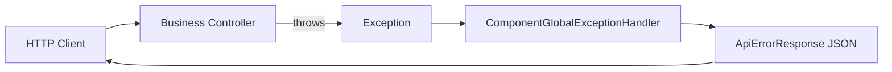

# common-exception · 详细设计

## 1. 架构位置



- 组件只处理 **已进入 Spring MVC 调度** 的异常。
- 过滤器链 / Security 入口异常：一期由 Spring 默认或后续 **common-auth** 协同，本模块不重复包装。

## 2. 包结构（autoconfigure 模块）

```
com.company.component.exception/
├── autoconfigure/ExceptionAutoConfiguration.java
├── properties/ExceptionProperties.java
├── core/
│   ├── ApiErrorResponse.java          # 统一响应 DTO
│   └── ExceptionMappingSupport.java   # 异常 → 响应 映射（Phase 3 实现）
├── web/
│   └── ComponentGlobalExceptionHandler.java  # @ControllerAdvice（Phase 3）
├── support/OrderConstants.java
└── spi/ExceptionErrorCodeResolver.java       # 业务扩展错误码
```

## 3. 条件装配

| 条件 | 说明 |
|------|------|
| `@ConditionalOnProperty(component.exception.enabled=true)` | `matchIfMissing=false` |
| `@ConditionalOnWebApplication(SERVLET)` | 非 Web 不注册 |
| `@ConditionalOnMissingBean(ComponentGlobalExceptionHandler.class)` | 业务可完全自研 |

自动配置注册文件：

`META-INF/spring/org.springframework.boot.autoconfigure.AutoConfiguration.imports`

```
com.company.component.exception.autoconfigure.ExceptionAutoConfiguration
```

**顺序**：`@AutoConfiguration` 不强制 before/after；`@ControllerAdvice` 使用 `@Order(OrderConstants.EXCEPTION_ADVICE)`，默认值 `Ordered.LOWEST_PRECEDENCE - 100`（早于业务随意设置的 LOWEST，便于业务 `@Order` 更高优先级覆盖）。

## 4. 统一响应体

```json
{
  "code": "VALIDATION_ERROR",
  "message": "参数校验失败",
  "timestamp": "2026-06-04T10:00:00+08:00",
  "path": "/api/demo",
  "traceId": "a1b2c3d4-e5f6-7890-abcd-ef1234567890",
  "errors": [
    { "field": "name", "message": "must not be blank" }
  ]
}
```

| 字段 | 一期 | 说明 |
|------|------|------|
| `code` | 是 | 机器可读错误码 |
| `message` | 是 | 人类可读摘要 |
| `timestamp` | 是 | ISO-8601 |
| `path` | 可配置关闭 | 来自 `component.exception.include-path` |
| `errors` | 校验类异常 | 字段级错误列表 |
| `stackTrace` | 仅 `expose-stack-trace=true` | 生产禁止开启 |
| `traceId` | **P3 起必填**（4xx/5xx） | 与 MDC `tid` 一致，见 [logging.md](../../architecture/logging.md)、[log/design.md](../log/design.md) §8 |

## 5. 异常映射（一期）

| 异常类型 | HTTP 状态 | 默认 code |
|----------|-----------|-----------|
| `MethodArgumentNotValidException` | 400 | `VALIDATION_ERROR` |
| `BindException` | 400 | `VALIDATION_ERROR` |
| `HttpMessageNotReadableException` | 400 | `BAD_REQUEST` |
| `MissingServletRequestParameterException` | 400 | `BAD_REQUEST` |
| `HttpRequestMethodNotSupportedException` | 405 | `METHOD_NOT_ALLOWED` |
| `NoHandlerFoundException` | 404 | `NOT_FOUND` |
| `Exception`（兜底） | 500 | `default-error-code` 配置值 |

业务异常（如自定义 `BusinessException`）通过 SPI 或后续 MINOR 扩展，一期骨架仅预留 `ExceptionErrorCodeResolver`。

## 6. SPI：ExceptionErrorCodeResolver

```java
public interface ExceptionErrorCodeResolver {
    /**
     * @return 若本解析器能处理则返回响应，否则返回 empty
     */
    Optional<ApiErrorResponse> resolve(Throwable ex, HttpServletRequest request);
}
```

| 规则 | 说明 |
|------|------|
| 注册 | 业务 `@Bean` 实现接口 |
| 组件 | `@ConditionalOnBean(ExceptionErrorCodeResolver.class)` 注入列表，按 `@Order` 依次尝试 |
| 无实现 | 走内置映射表，**启动不失败** |

## 7. 与现有 @ControllerAdvice 冲突

| 场景 | 策略 |
|------|------|
| 业务已有全局 Advice | 业务不引 starter，或 `enabled=false`，或自行注册更高优先级 Advice |
| 仅引本组件 | 默认注册 `ComponentGlobalExceptionHandler` |
| 业务也要统一 JSON | 业务 Advice 调用 `ApiErrorResponse` 工厂方法（Phase 3 提供静态构建器） |

## 8. 配置元数据

- `ExceptionProperties` + `spring-boot-configuration-processor`
- 敏感项：无；`expose-stack-trace` 在生产 profile 必须由配置中心显式设为 `false`

## 9. 测试计划（第十一节）

| # | 场景 |
|---|------|
| 1 | 无 `enabled` → 无 `ComponentGlobalExceptionHandler` Bean |
| 2 | `enabled=false` → 同上 |
| 3 | `enabled=true` + Web → Handler Bean 存在 |
| 4 | 业务注册 `ComponentGlobalExceptionHandler` → 组件默认不注册 |
| 5 | 非 Web ApplicationContext → 不注册 |
| 6 | sample 集成：访问触发 404/校验失败，响应 JSON 符合约定（Phase 3 后启用） |

## 10. 实施分期

| 阶段 | 内容 | 当前状态 |
|------|------|----------|
| 0 | 本文档 + phase0-checklist | ✅ |
| 1 | Maven 双模块骨架 | ✅（本次） |
| 2 | Properties + 元数据 | ✅（骨架） |
| 3 | Handler + 映射 + SPI 接线 | ✅ |
| 4 | AutoConfiguration 完整 Bean | ✅ |
| 5 | 单测 + sample 集成 | ✅ |
| 6～7 | 文档同步、发布 | 待做 |
