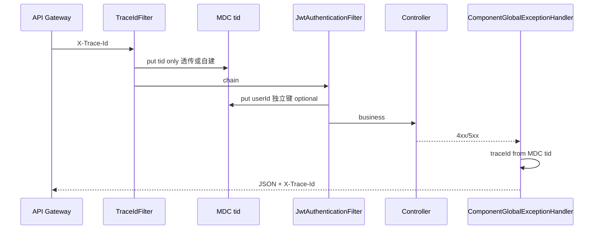

# common-log · 详细设计

## 0. 团队锁定决策

见 [README.md](./README.md)「团队锁定决策」与 [logging.md](../../architecture/logging.md)。编码不得违背。

---

## 1. 架构位置



| 分层 | 职责 |
|------|------|
| 网关 | 生成 `X-Trace-Id`，全链路透传 |
| **common-log** | 头 → MDC `tid`、请求 SLF4J 摘要、操作日志切面 |
| **common-auth** | 认证后写 `userId`/`username` MDC（log 协作，非硬依赖） |
| **common-exception** | 错误 JSON 必填 `traceId`（读 MDC，不依赖 log 模块） |
| 业务 SPI | `OperationLogRecorder` 异步落库 |

---

## 2. TraceId 解析规则（实现必须遵守）

```text
for header in component.log.trace.header-names:
    if request.getHeader(header) is not blank:
        traceId = trim(header)
        break
if traceId is null:
    if component.log.trace.allow-local-generate:
        traceId = generate()  // 可配置策略，默认 UUID
    else:
        traceId = null  // 不写 MDC，exception traceId 可为空或占位（需单测约定）
```

| 输入 | 行为 |
|------|------|
| `X-Trace-Id: abc` | MDC `tid=abc`，响应头/JSON 均为 `abc` |
| 无头 + `allow-local-generate=true` | 自建，写 MDC，可回写响应头 |
| 无头 + `allow-local-generate=false` | 不生成（仅特殊环境） |

**禁止**：已有非空 `X-Trace-Id` 时再 `UUID.randomUUID()`。

### 2.1 TraceId 形态与用户信息隔离

| 规则 | 说明 |
|------|------|
| 唯一职责 | 链路追踪：串起同一次请求的全部日志 |
| 内容 | 短、唯一、**无意义**、**无业务属性** |
| 生成 | 仅 `UUID` / 安全随机串 / Snowflake（可配置），**禁止** `userId + "-" + uuid` 等拼接 |
| 用户信息 | 仅写入 MDC `userId`、`username`；**禁止**写入 `tid` 或拼进 `X-Trace-Id` |
| 日志打印 | 同一行可同时出现 `[traceId=%X{tid}]` 与 `[userId=%X{userId}]`，**禁止**合并为单字段 |

`TraceIdResolver` 实现须校验（可选）：若解析到的头值含明显业务分隔模式，打 WARN 并仍透传（由网关保证格式），**禁止**服务端「修正」为带 userId 的串。

下游 HTTP 调用（Feign/RestTemplate）由业务或后续 MINOR 扩展 **TraceId 透传拦截器**；一期文档约定：出站请求头带当前 MDC `tid`（**仅** TraceId，不带 userId）。

---

## 3. 包结构（规划）

```
com.company.component.log/
├── autoconfigure/
│   ├── LogAutoConfiguration.java
│   └── LogWebAutoConfiguration.java      # Servlet Filter / Interceptor
├── properties/LogProperties.java
├── trace/
│   ├── TraceIdResolver.java              # 头解析 + 自建策略
│   └── TraceIdFilter.java                # OncePerRequestFilter, MDC put/clear
├── request/
│   └── RequestLoggingFilter.java         # 或 HandlerInterceptor：SLF4J 摘要
├── operation/
│   ├── OperationLog.java                 # 注解
│   ├── OperationLogAspect.java
│   └── OperationLogEntry.java
├── support/
│   ├── MdcKeys.java                      # tid, userId, username
│   ├── OrderConstants.java
│   └── LogMasking.java                   # 脱敏
└── spi/
    └── OperationLogRecorder.java
```

---

## 4. 条件装配

| 条件 | 说明 |
|------|------|
| `component.log.enabled=true` | `matchIfMissing=false` |
| `@ConditionalOnWebApplication(SERVLET)` | 非 Servlet 不注册 |
| `@ConditionalOnClass` Servlet API | Web 过滤器 |
| `@ConditionalOnBean(OperationLogRecorder)` | 操作日志切面（或 enabled + 可选 no-op 策略见评审） |
| Security 相关 MDC | `@ConditionalOnClass` + 可选读取 `SecurityContext` |

**Filter 顺序**（`OrderConstants`）：

| Filter | Order 相对关系 |
|--------|----------------|
| `TraceIdFilter` | **早于** `JwtAuthenticationFilter`（先有线 ID，再认证） |
| `RequestLoggingFilter` | **晚于** TraceId，**晚于** Security（摘要含 userId） |
| `JwtAuthenticationFilter` | auth 模块已有顺序；log 的 userId 写入可在 auth 之后由 **MdcUserContextFilter** 或 auth 回调协作 |

推荐：`TraceIdFilter` → auth 链 → `MdcUserContextFilter`（读 SecurityContext 写 userId）→ `RequestLoggingFilter`。

`@AutoConfiguration(after = AuthSecurityAutoConfiguration.class)` 仅用于 userId 协作配置，**不**添加对 auth 的 compile 依赖时使用 `@ConditionalOnClass` + 反射或独立 Filter 读 SecurityContextHolder。

---

## 5. 配置属性（LogProperties）

前缀：`component.log`

```yaml
component:
  log:
    enabled: true
    trace:
      header-names:
        - X-Trace-Id
      allow-local-generate: true
      response-header: true
    request:
      enabled: true
      log-level: DEBUG
      sample-rate: 1.0
      include-query: false
      exclude-paths:
        - /actuator/**
    operation:
      enabled: true
    mask:
      keys:
        - password
        - token
        - authorization
```

---

## 6. 请求日志（仅 SLF4J）

**一条请求结束时**打一条摘要（非逐行 body）：

| 字段 | 示例 |
|------|------|
| tid | MDC |
| method | GET |
| uri | /api/orders/1 |
| status | 200 |
| durationMs | 45 |
| userId | 可选 |

- 默认 **DEBUG**；生产用 `sample-rate` + INFO 时需评审。
- **禁止**记录完整 Authorization、密码、身份证号。
- **禁止** JDBC / 远程落库。

---

## 7. 操作日志 SPI

```java
public interface OperationLogRecorder {
    /**
     * 记录业务操作。必须快速返回，不得阻塞主链路。
     * 实现方应使用线程池或 MQ 异步持久化（文档强制推荐）。
     */
    void record(OperationLogEntry entry);
}
```

`OperationLogEntry` 规划字段：`traceId`（= MDC tid）、`module`、`action`、`operatorId`、`success`、`durationMs`、`requestUri`、`errorMessage`、脱敏后的 `extra` JSON。

`@OperationLog(module = "order", action = "create")` 切面：

- 成功/失败均记录；
- 异常不吞，业务异常仍抛出；
- `record()` 抛错：文档约定由实现方处理；组件层记录 ERROR 日志后**不**影响业务异常传播。

---

## 8. 与 common-exception 协作（必须）

### 8.1 响应体

`ApiErrorResponse` 增加字段（P3 与 exception 同版本或 exception MINOR）：

| 字段 | 类型 | 规则 |
|------|------|------|
| `traceId` | string | 4xx/5xx **必填**；值 = `MDC.get("tid")`；无则 `null` 或空串（单测覆盖无 log 场景） |

配置（exception 侧）：

```yaml
component:
  exception:
    include-trace-id: true   # 默认 true，P3 后引入
```

实现：`ExceptionMappingSupport.build(...)` 从 `MDC.get(MdcKeys.TID)` 读取，**不**依赖 log 模块类。

### 8.2 Filter 链错误

auth 的 `ComponentAuthenticationEntryPoint` 写 JSON 时同样带 `traceId`（读 MDC），与 exception 字段一致。

---

## 9. 与 SkyWalking 的关系

| 项 | 约定 |
|----|------|
| MDC 键 | **`tid`**，与 SW Logback `%X{tid}` 一致 |
| 网关头 | `X-Trace-Id` 与 SW Trace 语义对齐；接入 Agent 后日志与 APM 同一 ID |
| segmentId/spanId | 仅 Agent 写入，common-log 不生成 |

业务 logback 提前使用 `%X{tid}`，接入 `-javaagent` 后无需改键名。

---

## 10. 自动配置注册（规划）

`META-INF/spring/org.springframework.boot.autoconfigure.AutoConfiguration.imports`：

```
com.company.component.log.autoconfigure.LogAutoConfiguration
com.company.component.log.autoconfigure.LogWebAutoConfiguration
```

---

## 11. 测试计划

| # | 场景 |
|---|------|
| 1 | 无 `enabled` → 无 log Filter |
| 2 | 带 `X-Trace-Id` → MDC tid 等于头，且不变 |
| 3 | 带头再次进入 Filter → 不生成新 UUID |
| 4 | 无头 + allow-local-generate → 生成 tid |
| 5 | 请求结束 DEBUG 一条摘要 |
| 6 | 4xx 响应 JSON 含 traceId |
| 7 | `@OperationLog` + SPI mock → record 被调用 |
| 8 | MDC 在 finally 清理，线程池无泄漏 |

---

## 12. 实施分期

| 阶段 | 内容 | 状态 |
|------|------|------|
| 0 | README、design、logging.md、phase0-checklist | ✅ |
| 1 | Maven 双模块骨架 | ⬜ |
| 2 | LogProperties + TraceIdFilter + MDC | ⬜ |
| 3 | RequestLoggingFilter（SLF4J） | ⬜ |
| 4 | exception 增加 `traceId` 字段 + 测试 | ⬜ |
| 5 | `@OperationLog` + SPI | ⬜ |
| 6 | sample 集成 + `mvn verify` | ⬜ |
| 7 | 可发布 SNAPSHOT | ⬜ |

**建议**：Phase 2～4 作为 **P3.1 最小可发布**（链路 + 错误体 traceId）；Phase 5 为 **P3.2** 操作日志。
